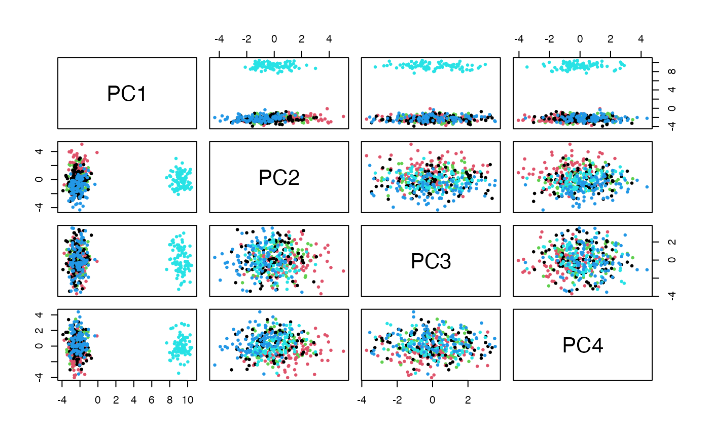
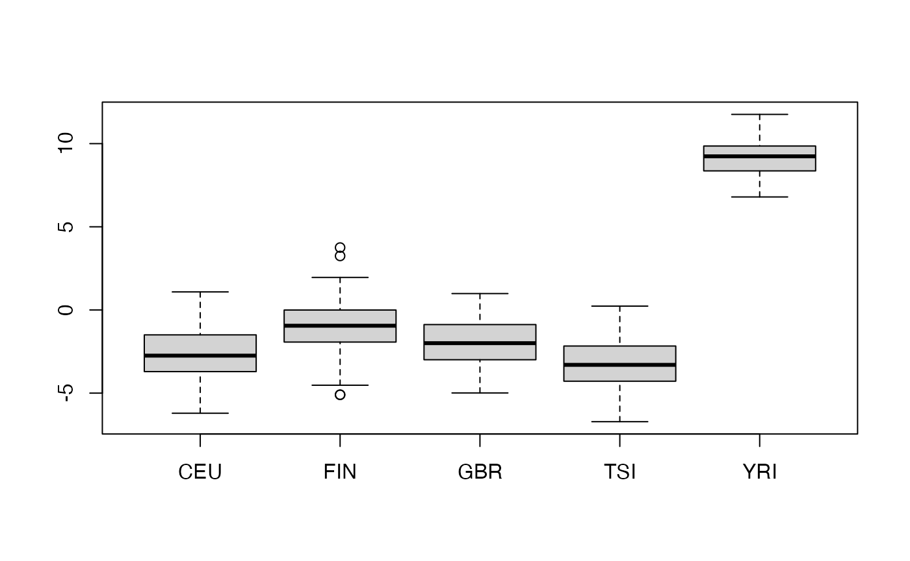

<div id="main" class="col-md-9" role="main">

# PlinkMatrix: DelayedArray interface to plink bed-type files

<div class="section level2">

## Introduction

Many genetic studies employ
[PLINK](https://www.cog-genomics.org/plink/2.0/) for data management and
analysis.

This package facilitates interrogation of PLINK bed files through the
Bioconductor
[DelayedArray](https://bioconductor.org/packages/DelayedArray/) protocol

</div>

<div class="section level2">

## Demonstration

The `example_PlinkMatrix` function will

-   retrieve a zip archive from a cloud store if needed, and place it in
    the default BiocFileCache cache
-   unzip the cached archive to bed, bim, fam files
-   create the DelayedArray interface to the unzipped archive

The example data are those distributed with tensorQTL, transformed to
bed using plink2.

<div id="cb1" class="sourceCode">

``` r
library(PlinkMatrix)
gdemo = example_PlinkMatrix()
colnames(gdemo) = gsub("0_", "", colnames(gdemo))
gdemo
```

</div>

    ## <367759 x 445> DelayedMatrix object of type "double":
    ##                         HG00096 HG00097 HG00099 ... NA20826 NA20828
    ##     chr18_10644_C_G_b38       0       0       0   .       0       0
    ##     chr18_10847_C_A_b38       0       0       0   .       0       0
    ##     chr18_11275_G_A_b38       0       0       0   .       0       0
    ##     chr18_11358_G_A_b38       0       0       0   .       0       0
    ##     chr18_11445_G_A_b38       0       0       0   .       0       0
    ##                     ...       .       .       .   .       .       .
    ## chr18_80259028_AG_A_b38       1       2       2   .       0       1
    ##  chr18_80259147_G_C_b38       0       0       0   .       0       0
    ##  chr18_80259181_A_G_b38       0       0       0   .       0       0
    ##  chr18_80259190_C_G_b38       1       0       0   .       1       0
    ##  chr18_80259245_C_A_b38       0       0       0   .       0       0

</div>

<div class="section level2">

## Sanity check

We will use ancestry information and approximate PCA to illustrate
plausibility of the approach used here.

We have codes for the ancestral origins of samples.

<div id="cb3" class="sourceCode">

``` r
data(g445samples)
table(g445samples$Population.code)
```

</div>

    ## 
    ## CEU FIN GBR TSI YRI 
    ##  89  92  86  91  87

We’ll take a random sample of 1000 SNP and retrieve 10 PCs, then
visualize aspects of the reexpression to PCs for discriminating
population of ancestry.

<div id="cb5" class="sourceCode">

``` r
library(irlba)
set.seed(1234)
ss = sort(sample(seq_len(nrow(gdemo)), size=1000))
pca = prcomp_irlba(t(gdemo[ss,]),10)
pairs(pca$x[,1:4], col=factor(g445samples$Population.code), pch=19, cex=.5)
```

</div>



<div id="cb6" class="sourceCode">

``` r
boxplot(split(pca$x[,2]+pca$x[,1], g445samples$Population.code))
```

</div>



</div>

<div class="section level2">

## SummarizedExperiment wrapper; subsetting with GenomicRanges

<div id="cb7" class="sourceCode">

``` r
data(example_GRanges)
library(SummarizedExperiment)
nse = SummarizedExperiment(list(genotypes=gdemo), 
   rowData=example_GRanges, colData=g445samples)
nse
```

</div>

    ## class: RangedSummarizedExperiment 
    ## dim: 367759 445 
    ## metadata(0):
    ## assays(1): genotypes
    ## rownames(367759): chr18_10644_C_G_b38 chr18_10847_C_A_b38 ...
    ##   chr18_80259190_C_G_b38 chr18_80259245_C_A_b38
    ## rowData names(0):
    ## colnames(445): HG00096 HG00097 ... NA20826 NA20828
    ## colData names(5): Sex Population.code Population.name
    ##   Superpopulation.code Superpopulation.name

<div id="cb9" class="sourceCode">

``` r
little = GenomicRanges::GRanges("chr18:1-100000")
subsetByOverlaps(nse, little)
```

</div>

    ## class: RangedSummarizedExperiment 
    ## dim: 353 445 
    ## metadata(0):
    ## assays(1): genotypes
    ## rownames(353): chr18_10644_C_G_b38 chr18_10847_C_A_b38 ...
    ##   chr18_99977_C_T_b38 chr18_99998_G_A_b38
    ## rowData names(0):
    ## colnames(445): HG00096 HG00097 ... NA20826 NA20828
    ## colData names(5): Sex Population.code Population.name
    ##   Superpopulation.code Superpopulation.name

</div>

<div class="section level2">

## Session information

<div id="cb11" class="sourceCode">

``` r
sessionInfo()
```

</div>

    ## R version 4.5.2 (2025-10-31)
    ## Platform: aarch64-apple-darwin20
    ## Running under: macOS Sequoia 15.7.4
    ## 
    ## Matrix products: default
    ## BLAS:   /System/Library/Frameworks/Accelerate.framework/Versions/A/Frameworks/vecLib.framework/Versions/A/libBLAS.dylib 
    ## LAPACK: /Library/Frameworks/R.framework/Versions/4.5-arm64/Resources/lib/libRlapack.dylib;  LAPACK version 3.12.1
    ## 
    ## locale:
    ## [1] en_US.UTF-8/en_US.UTF-8/en_US.UTF-8/C/en_US.UTF-8/en_US.UTF-8
    ## 
    ## time zone: America/New_York
    ## tzcode source: internal
    ## 
    ## attached base packages:
    ## [1] stats4    stats     graphics  grDevices utils     datasets  methods  
    ## [8] base     
    ## 
    ## other attached packages:
    ##  [1] irlba_2.3.7                 PlinkMatrix_0.99.0         
    ##  [3] SummarizedExperiment_1.40.0 Biobase_2.70.0             
    ##  [5] GenomicRanges_1.62.1        Seqinfo_1.0.0              
    ##  [7] DelayedArray_0.36.0         SparseArray_1.10.8         
    ##  [9] S4Arrays_1.10.1             abind_1.4-8                
    ## [11] IRanges_2.44.0              S4Vectors_0.48.0           
    ## [13] MatrixGenerics_1.22.0       matrixStats_1.5.0          
    ## [15] BiocGenerics_0.56.0         generics_0.1.4             
    ## [17] Matrix_1.7-4                Rcpp_1.1.1                 
    ## [19] BiocStyle_2.38.0           
    ## 
    ## loaded via a namespace (and not attached):
    ##  [1] xfun_0.56           bslib_0.10.0        httr2_1.2.2        
    ##  [4] htmlwidgets_1.6.4   lattice_0.22-9      vctrs_0.7.1        
    ##  [7] tools_4.5.2         curl_7.0.0          tibble_3.3.1       
    ## [10] RSQLite_2.4.6       blob_1.3.0          pkgconfig_2.0.3    
    ## [13] dbplyr_2.5.2        desc_1.4.3          lifecycle_1.0.5    
    ## [16] compiler_4.5.2      textshaping_1.0.4   htmltools_0.5.9    
    ## [19] sass_0.4.10         yaml_2.3.12         pkgdown_2.2.0      
    ## [22] pillar_1.11.1       jquerylib_0.1.4     cachem_1.1.0       
    ## [25] tidyselect_1.2.1    digest_0.6.39       dplyr_1.2.0        
    ## [28] purrr_1.2.1         bookdown_0.46       fastmap_1.2.0      
    ## [31] grid_4.5.2          cli_3.6.5           magrittr_2.0.4     
    ## [34] withr_3.0.2         filelock_1.0.3      rappdirs_0.3.4     
    ## [37] bit64_4.6.0-1       rmarkdown_2.30      XVector_0.50.0     
    ## [40] bit_4.6.0           otel_0.2.0          ragg_1.5.0         
    ## [43] memoise_2.0.1       evaluate_1.0.5      knitr_1.51         
    ## [46] BiocFileCache_3.0.0 rlang_1.1.7         glue_1.8.0         
    ## [49] DBI_1.3.0           BiocManager_1.30.27 jsonlite_2.0.0     
    ## [52] R6_2.6.1            systemfonts_1.3.1   fs_1.6.6

</div>

</div>
